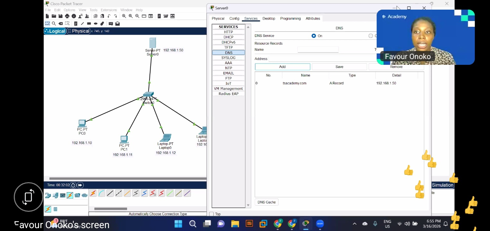

# cybersecurity-learning-log
Documenting my cybersecurity and ethical hacking journey
## TS Academy – Cisco Packet Tracer Labs  
**Instructor:** Favoured Onoko  
**Documented on 16th March 2026

### Packet Sniffer / Simulation Mode (Exercise 1)
**Objective:** Understand why hubs are insecure and how packets behave in a network.  
**Activities completed:**  
• Built a simple hub network with multiple PCs  
• Configured static IP addresses  
• Switched to **Simulation mode** (Packet Tracer’s built-in packet sniffer)  
• Pinged one device and watched the packet flood to **every** device on the network (broadcasting behaviour)  

**Key takeaway:** Hubs broadcast everything — no security, packets are visible to all devices.

### Simple LAN → Star Topology → DNS Server (Exercises 2–4)
**Objective:** Build a complete small-office LAN with 2 PCs, 2 laptops, and a DNS server.  

  
*Final topology: 2960 Switch + Server0 (192.168.1.50) with tsacademy.com A-record. All devices reachable.*

**What was done:**  
• Exercise 2: Basic switch LAN + ping test  
• Exercise 3: Expanded star topology + subnet mask test (wrong mask = no communication)  
• Exercise 4: Added DNS server, created A-record for `tsacademy.com`, configured clients, tested name resolution in browser and ping  

**Practice Task alignment:** Exactly matches the “small startup with 5 devices” scenario — everything talks to each other.

### What I Learned
- Simulation mode = how packets move across several devices
- Switch vs Hub difference  
- Importance of the correct subnet mask  
- How DNS actually works in real networks  
