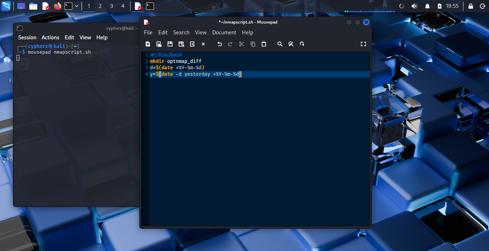
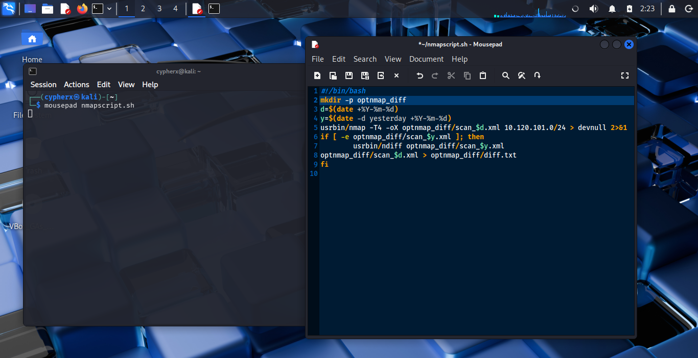
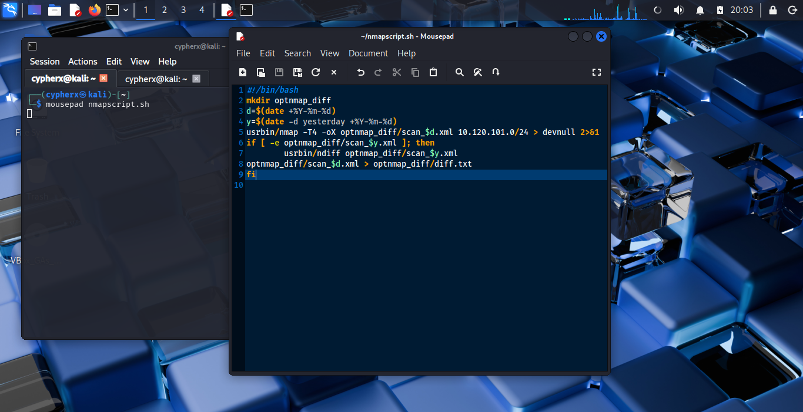
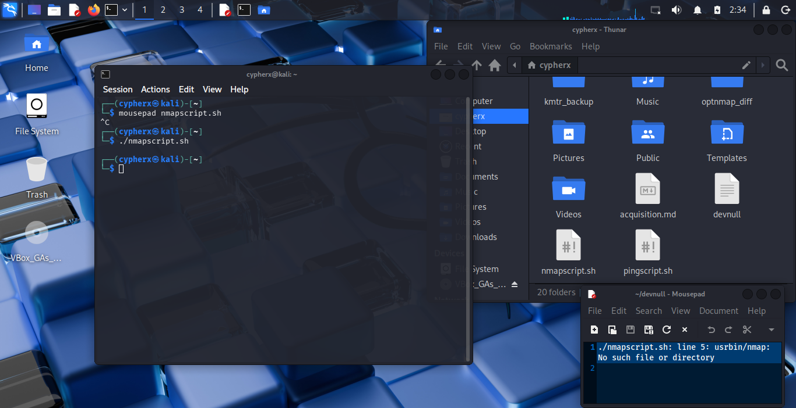
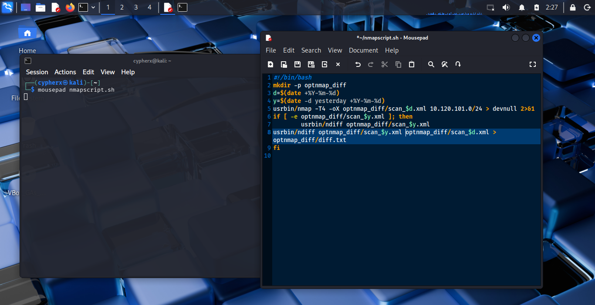
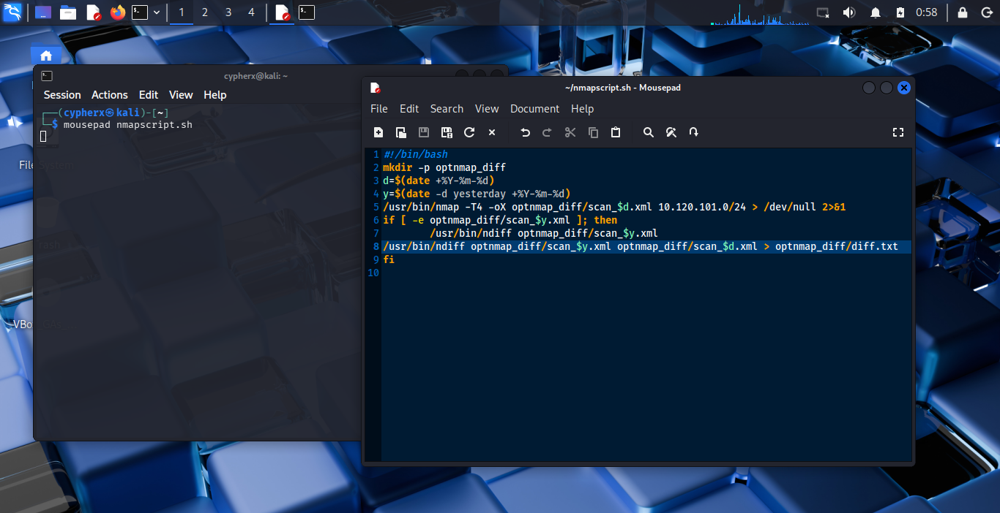
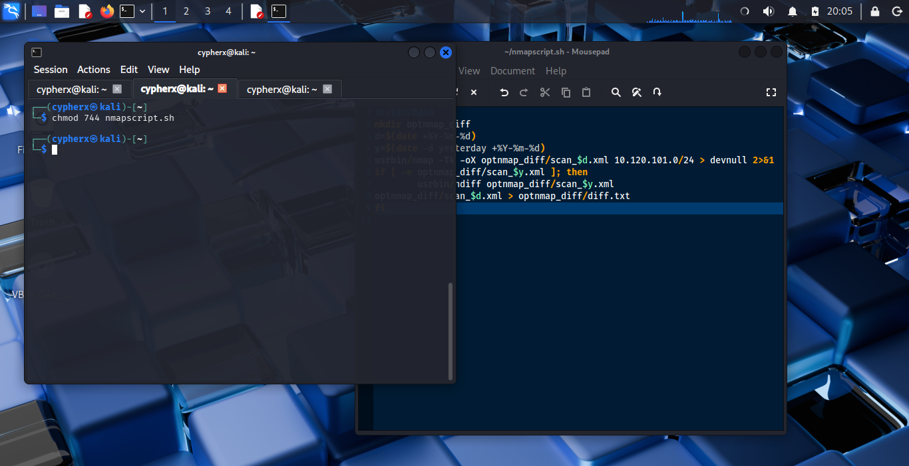
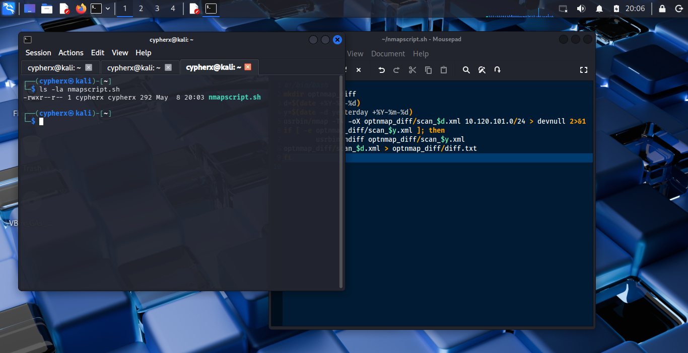
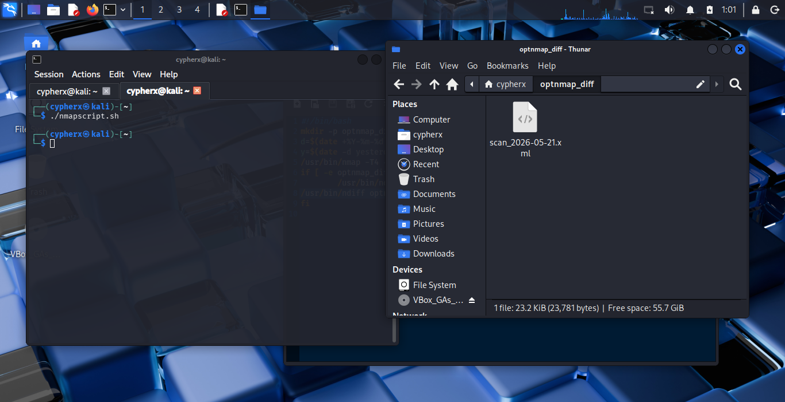

# Automated Network Watchdog

## Daily Nmap Differential Analysis

### Project Overview:
In a dynamic network environment, keeping track of active hosts, open ports, and surface-level topology changes is critical for maintaining a strong security posture. Manual scanning is tedious and prone to human oversight.
This project solves that problem by automating a daily /24 subnet scan using Nmap, logging the results in XML format, and utilizing Ndiff to compare the current day's network state against the previous day's baseline. By automating this process via a bash script, security teams can easily identify newly spun-up devices, unexpected open ports, or downed servers without lifting a finger.

### Tools & Technologies Used:
- **Bash Scripting:** Core automation and logic flow.
- **Nmap:** Aggressive (-T4) network scanning and XML output generation.
- **Ndiff:** Command-line tool for comparing Nmap XML outputs.
- **Linux CLI:** File permission management, directory structuring, and pipeline routing.

---

# Step-by-Step Code Walkthrough:
Rather than just throwing commands into a file, this script was built iteratively. Here is a breakdown of the logic, line by line.

<br>

### 1. **Setting the Stage & Time Travel (Variables)**
   <br>

   

   <br>
   
```bash
#!/bin/bash
d=$(date +%Y-%m-%d)
y=$(date -d yesterday +%Y-%m-%d)
```

- **The Shebang:** Standard practice to ensure the system executes the script using the Bash shell. This tells the system to use the Bash interpreter to run the code. Without this, the system might not know which "language" you’re speaking.
- **Date Variables:** To make differential analysis work, the script needs context of "today" and "yesterday". By assigning formatted date strings (+%Y-%m-%d) to variables `$d` and `$y`, I created a dynamic naming convention that allows the script to fetch the correct historical files automatically every time it runs.<br>
  - **d=$(date +%Y-%m-%d):**Today's date. Creates a variable *d* that stores today's date (e.g., 2026-05-24).
  - **y=$(date -d yesterday +%Y-%m-%d)**​Yesterday's Date. Same as above, but it calculates yesterday's date. This is crucial for the "comparison" part of the script.
  - **The $(...):** This is "command substitution." It runs the command inside and saves the result to the variable.

<br>

### 2. **Bulletproofing Directory Management**
   <br>
   
   
   
   <br>
   
   ```bash
   mkdir -p optnmap_diff
   ```

- **The Evolution**

Essentially,this line creates a folder to store your scan results.<br>
In the initial iteration of this script, you'll notice I simply used `mkdir optnmap_diff`. However, on the second of execution, the script threw an error like so:

> `mkdir: cannot create directory 'optnmap_diff': File exists.`

## The Fix

I updated the command to include the `-p` (parents) flag. This tells the script "only create it if it doesn’t exist, otherwise don't complain." <br>
This handles the error gracefully; if the directory already exists, it simply moves on without interrupting the automation flow. This is crucial for scripts intended to run as Cron jobs.

<br>

### 3. The Heavy Lifter

 **Executing the Scan**
 ```bash
/usr/bin/nmap -T4 -oX optnmap_diff/scan_$d.xml 10.120.101.0/24 > /dev/null 2>&1
 ```
<br>



<br>

> [!IMPORTANT]
> The real deal is to ensure absolute paths like /usr/bin/nmap *(and not usrbin/ like i did)* and /dev/null are properly slashed in your production environment to prevent pathing execution errors like so:


<br>



<br>

We then call *"Nmap"*, targeting a specific `/24` subnet.

- **Speed**
  The `-T4` flag scales 0-5. 4 is "Aggressive" (fast but still reliable for most networks). This essentially speeds up the execution time, making it practical for a daily cron task.

- **Formatting**
  Ndiff requires XML files to run comparisons, so the `-oX` flag is used, utilizing the `$d` (today) variable to name the output file (e.g., `scan_2026-05-21.xml`).

- ​**Date Variable**
  optnmap_diff/scan_$d.xml: Saves the file using today’s date (e.g., scan_2026-05-24.xml).

- **Network Range**
  ​10.120.101.0/24: Your target network range.

- **Silencing Output**
  By appending `> /dev/null 2>&1` *(and not "devnull/")*, we route all standard output and standard errors into the void. This keeps the terminal clean and prevents massive log files from building up if automated.

<br>

### 4. The Intelligence: Conditional Differential Analysis



<br>

This was, of course, the "before picture". Right before I tested it and it threw the error I referenced earlier.

<br>

| **Breakdown**

<br>

- **The Logic**
  If you run this script on Day 1, there is no "yesterday" file to compare it to, which would normally cause `ndiff` to crash or throw an error.

- **The Condition**<br>
  ```if [ -e optnmap_diff/scan_$y.xml ]; then```
  **The Logic Gate:** This checks if a scan from yesterday (`$y.xml`) actually exists. If it does, it executes `ndiff`.
  **-e:** Short for "exists." If there is no scan from yesterday, the script has nothing to compare today's scan against, so it just ends.


- ```usrbin/ndiff optnmap_diff/scan_$y.xml optnmap_diff/scan_$d.xml```
  **The Difference Engine:** `ndiff` is a tool that compares two Nmap XML files. It looks for things like "Port 80 was open yesterday but closed today" or "A new host appeared."


 - **The Output**
  It compares yesterday's baseline against today's scan.
  The differences are piped into a clean, human-readable `diff.txt` file.

- **fi**
  End If: This just closes the if statement
  
<br>

| **The modification on the file path**

<br>



---

# Deployment & Troubleshooting

During development, establishing proper execution rights was a key priority.

<br>

## Permission Assignment
Upon creation, the script lacked execution permissions. I utilized:

<br>



<br>

```bash
chmod 744 nmapscript.sh
```

to grant the owner (myself) Read, Write, and Execute privileges (`-rwxr--r--`), while restricting other users to Read-Only.

<br>

## Verification
I opened a new terminal environment to verify the permission state changes using:

<br>



<br>

```bash
ls -la
```
to ensure the environment was secure before execution.

<br>

## Validation
After running the stabilized script:

```bash
./nmapscript.sh
```
I verified via the file manager that the `optnmap_diff` directory was successfully populated with `scan_2026-05-21.xml`.


