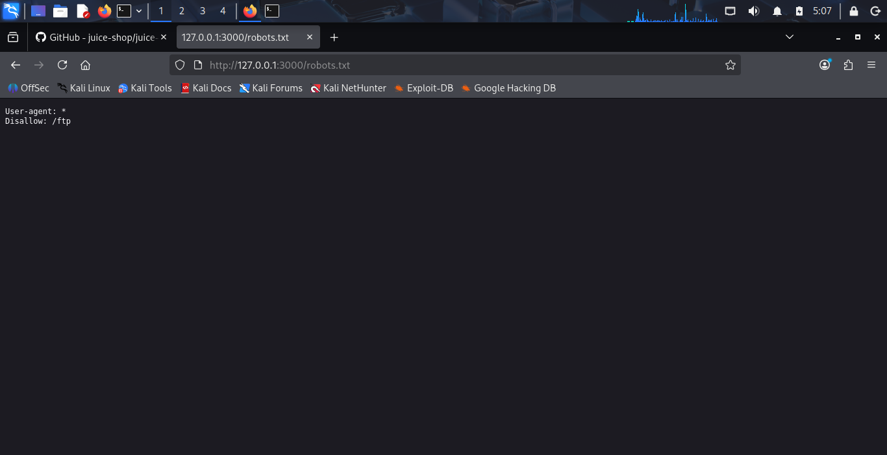
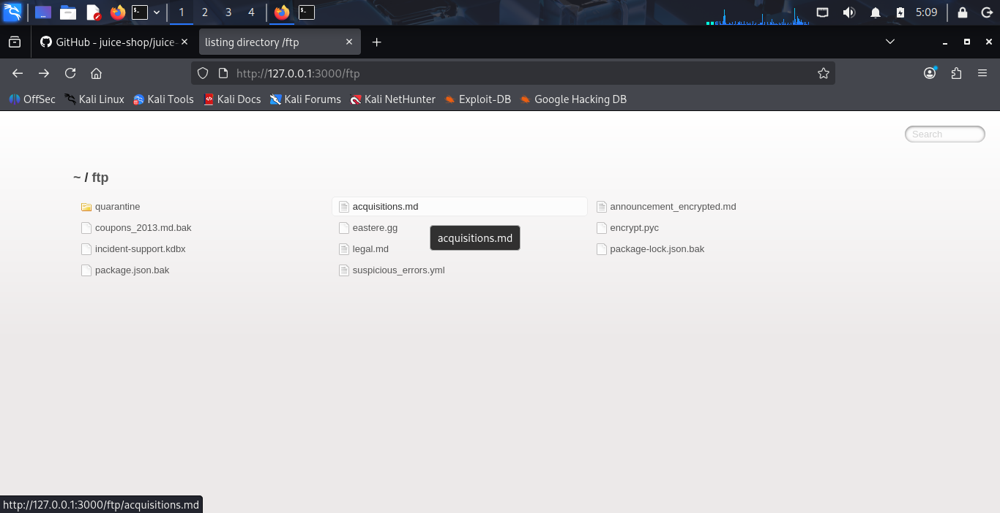
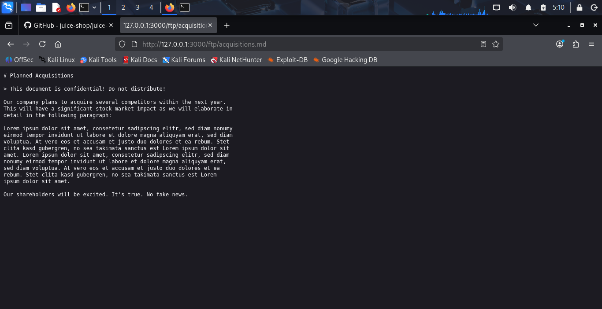
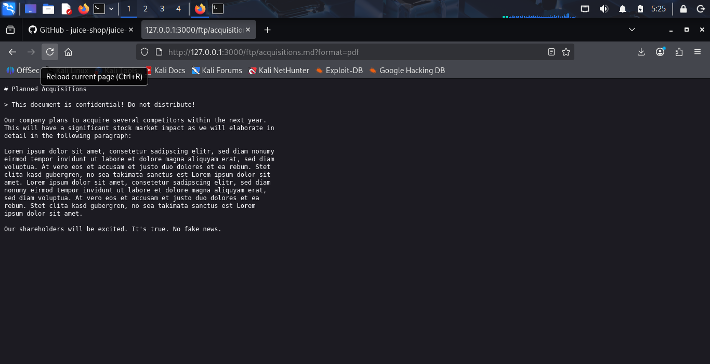
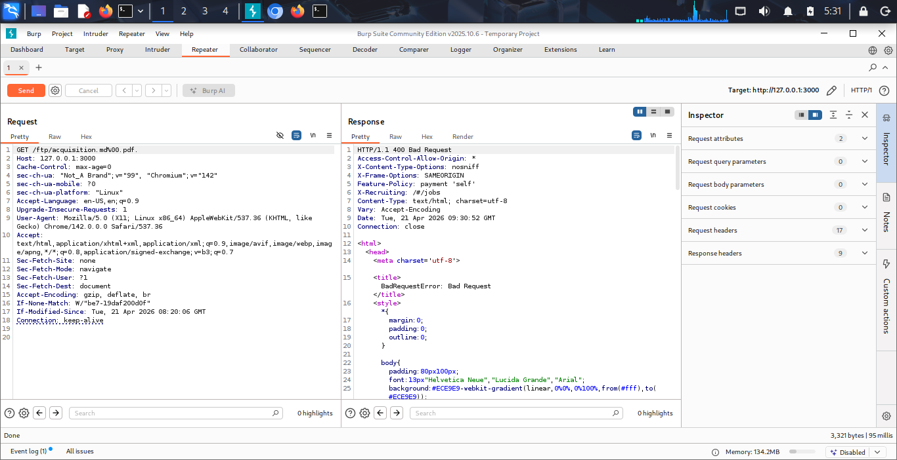
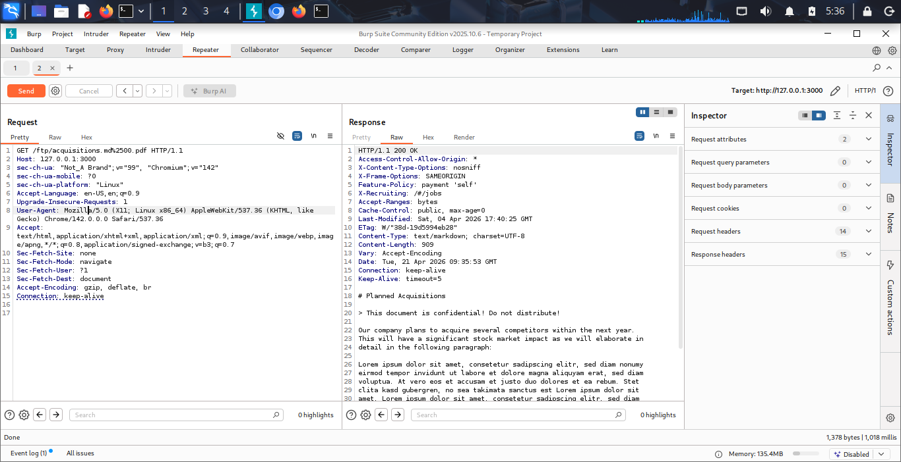
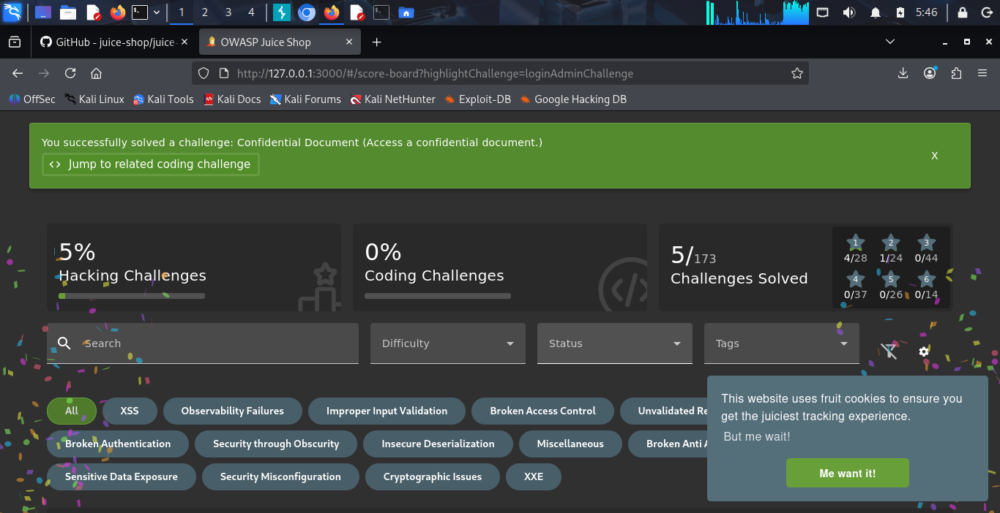

# Lab Report: OWASP Juice Shop - Sensitive Data Exposure (SDE) Challenge

*Date: April 21, 2026*  
*Topic: Exploiting Improper Input Validation for Data Leakage*  
*Tools Used: OWASP Juice Shop, Mozilla Firefox, Burp Suite Community Edition*

## Executive Summary

This documentation outlines the successful identification and exploitation of a Sensitive Data Exposure vulnerability within the OWASP Juice Shop application. The vulnerability stemmed from insufficient input validation of file extensions on a publicly accessible FTP directory. By manipulating HTTP requests using Burp Suite and employing a poison null byte technique (%00), security filters were bypassed, allowing unauthorized access to a confidential document (acquisitions.md). This report details the precise methodology, verification, and successful extraction of the target data.

## 1. Initial Reconnaissance: Locating Restricted Directories

My first objective was to discover any "hidden" or restricted application paths. I began with standard directory enumeration starting from the application root.

### Procedure

* Navigate to the application root in the browser.
* Inspect common sensitive files. We targeted /robots.txt to identify directories that search engine crawlers are requested not to index.



### Commentary

Accessing http://127.0.0.1:3000/robots.txt revealed a Disallow: /ftp directive. While intended for crawlers, this serves as immediate reconnaissance for security analysts, flagging ```/ftp``` as a potential directory containing sensitive material.

## 2. Directory Enumeration: Identifying Target Data

Following the leak from robots.txt, I proceeded to manually enumerate the newly discovered ``` /ftp``` directory to examine its contents.

### Procedure

* Navigate directly to the /ftp path identified in the previous step.
* Analyze the directory listing for files that indicate sensitive information exposure.

 

### Commentary

Accessing http://127.0.0.1:3000/ftp provided a successful directory listing. My analysis immediately identified several critical files that should not be publicly accessible, including several backup files (.bak), a KeyPass database (.kdbx), and the primary target: acquisitions.md.

## 3. Initial Access Attempt & Filter Analysis

I attempted to download the target file directly to test the application's access control mechanisms. This provided crucial information about how security filters were implemented.

### Procedure

* Click the hyperlink for acquisitions.md within the directory listing.
* Observe the application's response and any error messages generated.

.png)

.png)


### Commentary

The direct access attempt failed with a 403 Forbidden error. The key insight was the specific error message provided by the application: "Only .md and .pdf files are allowed!" This indicated that the application was enforcing access control using a file extension whitelist on the server side, rather than proper access control lists (ACLs). This identified the critical vulnerability to exploit: bypassing the input validation filter.

## 4. Exploitation Phase: Configuring Traffic Interception

To bypass the file extension validation, I determined that I needed to manipulate the raw HTTP request. This required intercepting the communication between our browser and the server using Burp Suite.

### Procedure

* Launch Burp Suite Community Edition.
* Configure the browser to route traffic through the Burp Suite user-driven proxy (typically 127.0.0.1:8080).
* Attempt the file access again from the browser to capture the request in Burp.
* Once captured in the Proxy tab, transfer the request to the Repeater module (Ctrl+R) for manual editing and re-submission.





### Commentary

With Burp Suite configured, I successfully intercepted a standard request. This step confirmed my proxy setup was functioning correctly and I was ready to capture and manipulate the specific request for the sensitive file. (I used a login request here to verify interception before targeting the FTP file).

## 5. Exploitation Phase: Developing the Bypass (Null Byte Injection)

My objective was to construct a request that passes the server’s security check (.md or .pdf file present) while also instructing the file system to serve the actual acquisitions.md file. I employed a classic Null Byte Injection attack.

The application’s validation logic appeared to check if the end of the URL string matches a whitelist. By appending an allowed extension after the null byte, I can trick the filter.

### Procedure

* Go to Burp Suite Repeater.
* Modify the target URL in the GET request line.
* Target Path: /ftp/acquisitions.md%00.pdf

### Commentary on the Payload

The key is %00, which is the URL-encoded representation of the Null Byte character (\0).

* How the Security Filter Sees It: The filter inspects the string /ftp/acquisitions.md%00.pdf. It sees that it ends in .pdf and permits the request.
* How the Back-end System (Node.js/Express) Sees It: The back-end retrieves the path. When Node.js passes this path string to lower-level C/C++ file system APIs, the Null Byte is interpreted as a "string terminator." Everything after %00 is discarded. The file system therefore executes: Open("/ftp/acquisitions.md").

### Initial Bypass Attempt (400 Bad Request)

I first tried GET /ftp/acquisitions.md%00. This resulted in a 400 Bad Request error. The application's web server (Express/serve-index) rejected the request because the URL itself was malformed by including the raw Null Byte terminator without a subsequent valid path structure.


(Note: A similar error is visible in the browser evidence image_1.png and image_6.png)

This confirmed I must follow the null byte with a valid extension (like .pdf or .md) that satisfies the whitelist filter while keeping the request structurally valid for the web server itself.

## 6. Exploitation Phase: Successful Payload Execution

I refined the payload to satisfy both the filter (the whitelist extension) and the file system API (the termination).

### Procedure

* In Burp Suite Repeater, adjust the URL to the full bypass payload:  
  GET /ftp/acquisitions.md%00.pdf
* Send the request.





### Commentary

The refined payload worked perfectly. The response status changed to 200 OK, confirming the filter bypass was successful. We verified the output in the Raw response tab of Burp Suite, which now displayed the full, confidential content of acquisitions.md ("Planned Acquisitions," "This document is confidential!"). The exploit was validated.

## 7. Data Extraction and Final Verification

The final step was to confirm the data could be extracted cleanly in the user environment and that the exploit was registered on the main application scoreboard.

### Procedure

* Copy the functional URL from Burp Suite (http://127.0.0.1:3000/ftp/acquisitions.md%00.pdf) and paste it directly into the browser.
* Observe the browser's render of the file.
* Navigate to the application /score-board to confirm the challenge completion.





### Commentary

Accessing the complex URL in the browser cleanly rendered the sensitive Markdown file. Crucially, navigate to the /score-board confirmed the success with a prominent green notification: "You successfully solved a challenge: Confidential Document (Access a confidential document)." This solidified our experimental findings and confirmed the vulnerability.

## Conclusion

This lab successfully demonstrated a critical Sensitive Data Exposure vulnerability in the OWASP Juice Shop. By bypassing a weak file-extension whitelist filter using a Null Byte Injection attack, we accessed and extracted confidential business information (acquisitions.md). The vulnerability highlights the danger of relying on input validation patterns rather than strong, defense-in-depth access controls. Improper reliance on whitelists that can be "terminated" or manipulated leads directly to data leakage.

## Recommended Remediation

* Implement Robust ACLs: Access control for files in the /ftp directory should be managed by strict, identity-aware Access Control Lists (ACLs), not by inspecting file extensions in the URL string.
* Disable Directory Listing: Public access to directory listings (http://127.0.0.1:3000/ftp) should be disabled globally unless strictly required by a business case.
* Move Backups and Configs: Sensitive backup files (.bak, .kdbx) must be stored outside the web root, ideally in an isolated storage container accessible only by the application back-end via specific APIs.
