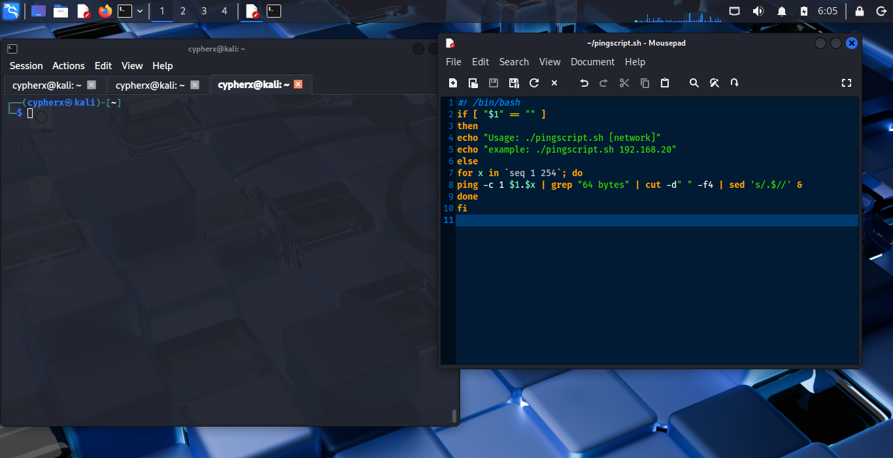
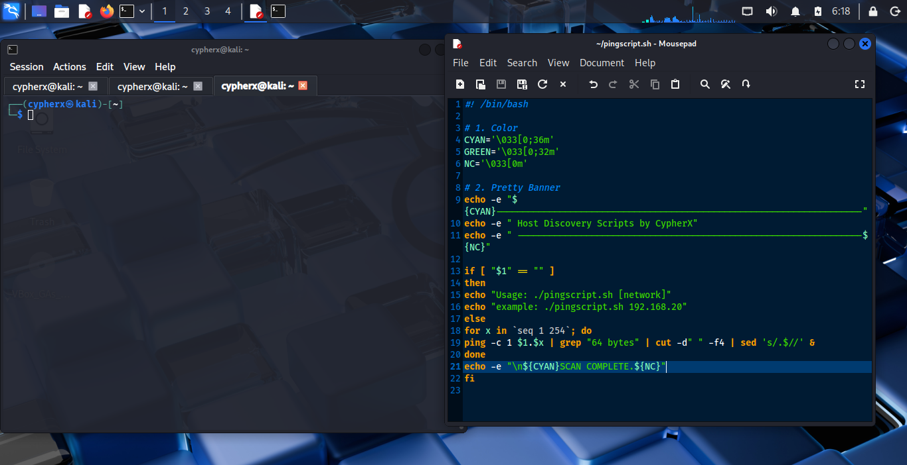
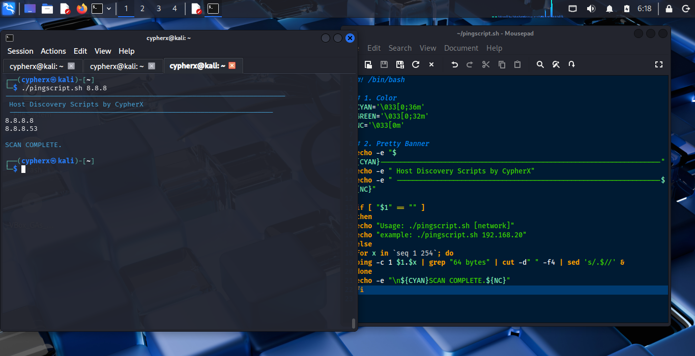

# CypherX: Parallel Network Recon Tool
## Project: Automating Host Discovery in Linux Environments
## Author: CypherX
## Platform: Kali Linux / VirtualBox

---
### Executive Summary
During network penetration testing labs, manual host discovery is time-consuming. This project documents the creation and optimization of a bash-based ICMP scanner. The goal was to move from a slow, linear discovery method to a high-speed parallelized tool capable of scanning a Class C subnet in seconds.

---
## Phase 1: The Blueprint (Script Creation)
Everything starts in the editor. I initiated the project using mousepad to define the core logic.


#### 1. The Shebang & Variables

```bash
#!/bin/bash
echo "Usage: ./pingscript.sh [network]"
echo "example: ./pingscript.sh 192.168.20"

```
- **Line 1:** The `#!` (Shebang) tells the OS to use the Bash interpreter located in `/bin/bash` to execute this file.
- **​The Command (echo):** In Bash, echo is used to print strings of text to the standard output (the terminal).
- **​The Syntax Instruction:** *echo "Usage: ./pingscript.sh [network]"* explicitly tells the user that the script requires an argument ([network]) to function.
- **​The Practical Example:** echo "example: ./pingscript.sh 192.168.20" provides a real-world template. This is a "Pro" touch that reduces user error by showing exactly what the input should look like (three octets).


## Phase 2: Usage Test

Before the script executes the scan, it runs a validation check to ensure the user has provided the necessary network parameters. This prevents the script from executing with null variables, which would result in terminal errors.


- **​Running without Arguments**  If the script is executed without a target, the built-in conditional logic catches the null input and displays a help menu. This prevents the script from running an empty loop.


## Phase 3: Setting Permissions

​Before execution, the script must be granted executable permissions. Using the chmod (change mode) command ensures the Linux kernel recognizes the file as a program rather than a plain text file.


> [!NOTE]
> I opted for 744. This allows the owner (cypherx) to Read, Write, and Execute, while providing only Read access to others, maintaining a secure posture for the tool. The `chmod +x` is most often used in real world environments but I chose 744 for thus lab because it's stealtheir.


## Phase 4: Adding functionality with `if` statements


**Initial Implementations**

​- *Input Validation:* To prevent execution errors, I implemented a conditional if-else block. The script checks if a        command-line argument (the network prefix) has been provided. If the argument is missing, the script provides a.         usage example: ./pingscript.sh 192.168.20.

- *​Targeted Iteration:* I utilized a for loop combined with the seq command to iterate through the host range of 1 to.      254. This allows for a comprehensive scan of a standard Class C subnet.

- *​Network Concatenation:* The script dynamically builds target IP addresses by appending the loop variable ($x) to the.    user-provided network prefix ($1).

- *​Discovery Mechanism:* I employed the ping command with the -c 1 flag. This sends a single ICMP echo request to each.     host, allowing for a quick check of host availability while minimizing network noise.

```bash
if [ "$1" == "" ]
then
echo "Usage: ./pingscript.sh [network]"
echo "example: ./pingscript.sh 192.168.20"
fi
```
- **The Logic:** `$1` represents the first argument typed after the script name.
- **The Check:** If `$1` is empty (the user just typed `./pingscript.sh`), the script triggers the `then` block. This prevents the script from crashing or running an infinite loop on a null value.
- **After adding functionality with the conditional `if` statement, I perdormed a test run by using the script with and without an argument**


# The Problem: Excessive Output Noise
​Initial executions of the pingscript.sh (as seen in the terminal logs) generated a high volume of "cumbersome" data. Specifically, for every IP address probed, the standard ping utility returns:
- ​*ICMP Echo Request headers.*
- *​Detailed packet statistics (transmitted, received, packet loss).*
​- *Timing information.*


​   When scanning a full range of 254 addresses, these verbose results bury the essential information—the active IP addresses—under hundreds of lines of irrelevant connection statistics and timeout errors for inactive hosts.


# ​The Solution: Bash Filtering and Refinement

​To transform this into a professional-grade tool, the script was updated to filter the output. The refinement focuses on boolean Discovery — Stripping away the packet headers and footers to only display IPs that return a successful response.


》 **Filtering Logic: Cleaning Up the Noise**

To keep the log output clean, I ran the raw output through a filtering pipeline. The goal was to strip away repetitive terminal text and isolate only the key data points—IP addresses and response times—that are relevant.

---

》 **The Filtering Pipeline**

The script uses a three-stage process to refine the data:

➤ `grep "64 bytes"`
   This is the first pass. It extracts only the successful response lines, ignoring all `"Request timeout"` errors and      summary statistics at the bottom.

➤  `cut`
    It isolates only the required fields (I used a space delimiter here) to essentially remove any unnecessary.              information/segments — such as icmp — before the IP address.

➤  `sed`
    This step removes the `"64 bytes from"` prefix. While small, this change makes the output look less like a raw.          terminal dump and more like a structured, curated log.

➤   `&`
     This is the final refinement stage. By appending the & to the end of the command or script execution, the process.       is pushed to the background. This is a subtle but essential part of the setup—it means I can fire off a scan and.        immediately move on to the next task in the same shell without waiting for the pings to finish.

---

The result is a clean, focused dataset that highlights only the information needed for analysis, improving both readability and professionalism.




## Phase 5: Adding Style


#### The CypherX Signature: Branding & UI Styling

**A powerful tool should look the part.** I moved beyond the default terminal output by implementing a custom banner and a color-coded interface. This isn't just for aesthetics—it improves readability during high-pressure reconnaissance tasks.



》 **The Visual Logic**

➤ **ANSI Color Variables**
     I defined specific variables like `${CYAN}` and `${GREEN}` at the top of the script. This makes the code modular;        if I want to change the theme later, I only have to update one line instead of searching through the whole script.

➤ **The Power of `echo -e`**
     To get these colors to actually show up in the terminal, I used the `-e` flag. This tells Bash to "enable"               backslash escapes, turning raw codes like `\033[0;36m` into the vibrant colors you see on screen.

➤ **The Banner**
     I used simple characters (hyphens and text) to create a structured header. This clearly identifies the tool as a.        CypherX project, ensuring that any screenshots or logs taken during a penetration test are professionally branded.
     




> [!NOTE]
## Why Style Matters in Security

○ *Visual Confirmation*
Using `${GREEN}` for live hosts and `${CYAN}` for status updates allows me to scan the terminal quickly. In a real-world scenario, you don't want to dig through white-on-black text to find your targets.

○ *Professionalism*
Documentation and "fit and finish" are what separate a quick one-liner from a reusable script. It shows a recruiter that I build with the end-user in mind.

○ *Clean Exit*
I always include `${NC}` (No Color) at the end of my strings. This "resets" the terminal so my next command doesn't accidentally stay cyan. It’s a small detail, but it’s the difference between an amateur script and a polished tool.


