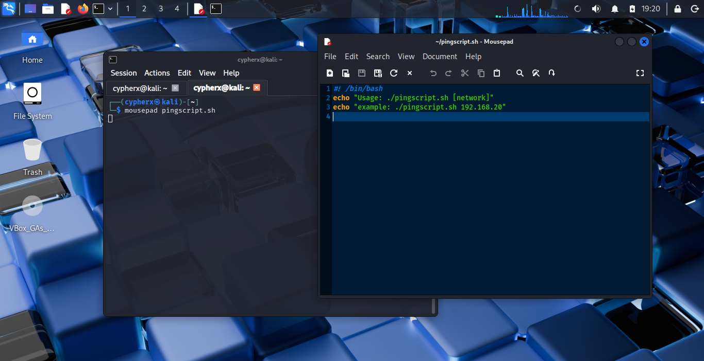
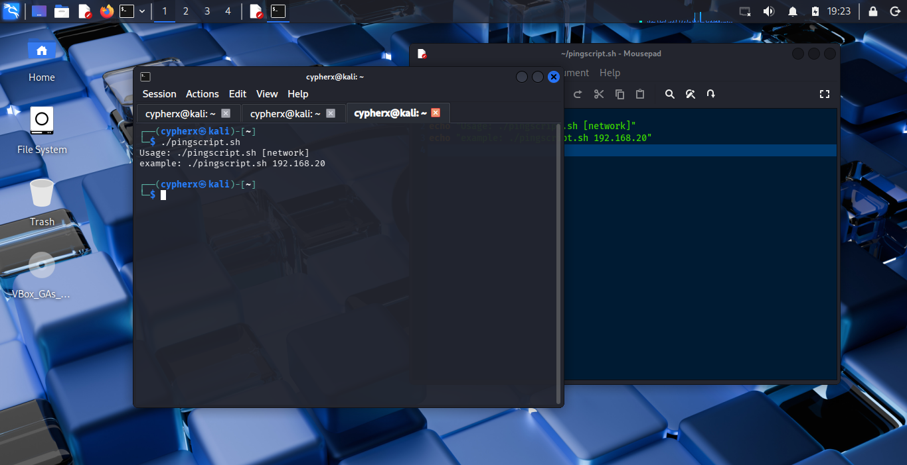
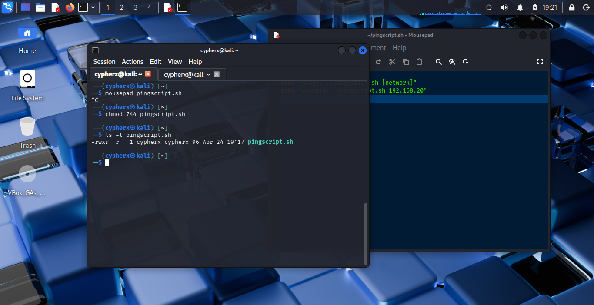
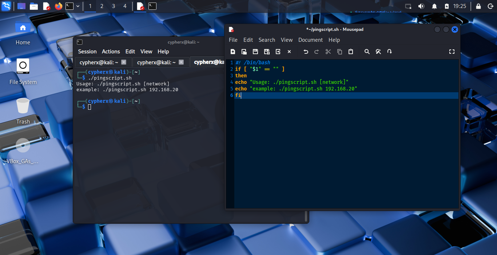
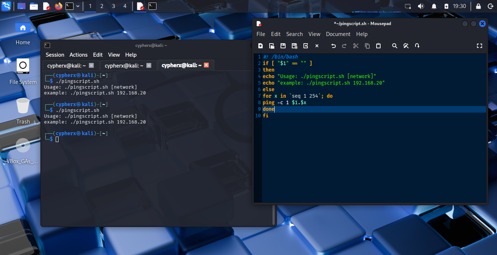
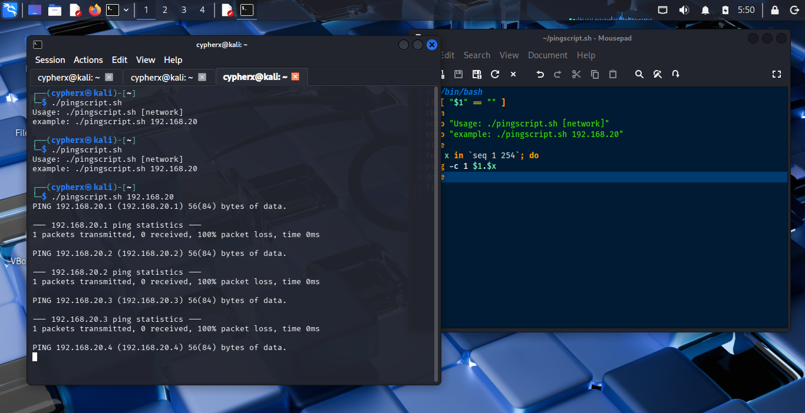

# CypherX: Parallel Network Recon Tool
## Project: Automating Host Discovery in Linux Environments
## Author: CypherX
## Platform: Kali Linux / VirtualBox

---
### Executive Summary
During network penetration testing labs, manual host discovery is time-consuming. This project documents the creation and optimization of a bash-based ICMP scanner. The goal was to move from a slow, linear discovery method to a high-speed parallelized tool capable of scanning a Class C subnet in seconds.

---
### Phase 1: The Blueprint (Script Creation)
Everything starts in the editor. I initiated the project using mousepad to define the core logic.




#### 1. The Shebang & Variables
```bash
#!/bin/bash
echo "Usage: ./pingscript.sh [network]"
echo "example: ./pingscript.sh 192.168.20"

```
- **Line 1:** The `#!` (Shebang) tells the OS to use the Bash interpreter located in `/bin/bash` to execute this file.
- **​The Command (echo):** In Bash, echo is used to print strings of text to the standard output (the terminal).
- **​The Syntax Instruction:** echo "Usage: ./pingscript.sh [network]" explicitly tells the user that the script requires an argument ([network]) to function.
- **​The Practical Example:** echo "example: ./pingscript.sh 192.168.20" provides a real-world template. This is a "Pro" touch that reduces user error by showing exactly what the input should look like (three octets).


#### 2. Usage Test

Before the script executes the scan, it runs a validation check to ensure the user has provided the necessary network parameters. This prevents the script from executing with null variables, which would result in terminal errors.



- **​Running without Arguments**  If the script is executed without a target, the built-in conditional logic catches the null input and displays a help menu. This prevents the script from running an empty loop.


#### 3. Setting Permissions
​Before execution, the script must be granted executable permissions. Using the chmod (change mode) command ensures the Linux kernel recognizes the file as a program rather than a plain text file.



> [!NOTE]
> I opted for 744. This allows the owner (cypherx) to Read, Write, and Execute, while providing only Read access to others, maintaining a secure posture for the tool. The `chmod +x` is most often used in real world environments but I chose 744 for thus lab because it's stealtheir.


#### 3. Adding functionality with `if` statements



**Initial Implementations**

​- *Input Validation:* To prevent execution errors, I implemented a conditional if-else block. The script checks if a        command-line argument (the network prefix) has been provided. If the argument is missing, the script provides a.         usage example: ./pingscript.sh 192.168.20.

- *​Targeted Iteration:* I utilized a for loop combined with the seq command to iterate through the host range of 1 to.      254. This allows for a comprehensive scan of a standard Class C subnet.

- *​Network Concatenation:* The script dynamically builds target IP addresses by appending the loop variable ($x) to the.    user-provided network prefix ($1).

- *​Discovery Mechanism:* I employed the ping command with the -c 1 flag. This sends a single ICMP echo request to each.     host, allowing for a quick check of host availability while minimizing network noise.

```bash
if [ "$1" == "" ]
then
echo "Usage: ./pingscript.sh [network]"
echo "example: ./pingscript.sh 192.168.20"
fi
```
- **The Logic:** `$1` represents the first argument typed after the script name.
- **The Check:** If `$1` is empty (the user just typed `./pingscript.sh`), the script triggers the `then` block. This prevents the script from crashing or running an infinite loop on a null value.
- **After adding functionality with the conditional `if` statement, I perdormed a test run by using the script with and without an argument**




# The Problem: Excessive Output Noise
​Initial executions of the pingscript.sh (as seen in the terminal logs) generated a high volume of "cumbersome" data. Specifically, for every IP address probed, the standard ping utility returns:
- ​*ICMP Echo Request headers.*
- *​Detailed packet statistics (transmitted, received, packet loss).*
​- *Timing information.*


​   When scanning a full range of 254 addresses, these verbose results bury the essential information—the active IP addresses—under hundreds of lines of irrelevant connection statistics and timeout errors for inactive hosts.

# ​The Solution: Bash Filtering and Refinement

​To transform this into a professional-grade tool, the script was updated to filter the output. The refinement focuses on Boolean Discovery: stripping away the packet headers and footers to only display IPs that return a successful response.
​Key Optimization Steps:
​Input Validation: Added a conditional check to ensure the user provides a network prefix (e.g., 192.168.20), preventing script errors.
​Output Suppression: Utilized grep or redirection to discard "Destination Host Unreachable" and "100% packet loss" messages.
​Streamlining: Modified the loop to print only the specific IP address when a successful ICMP reply is received.
​Technical Workflow
​The script follows a logical iteration process:
​Variable Injection: Takes the user's input as $1.
​Iteration: Uses a for loop to cycle through the host portion of the IP (seq 1 254).
​Execution: Fires a single ICMP count (-c 1) at each generated address.
​Filtering: (Revised) Greps for the phrase "64 bytes

#### 3. The Execution Loop (The "Engine")
```bash
for x in `seq 1 254`; do
ping -c 1 $1.$x | grep "64 bytes" | cut -d " " -f4 | sed 's/.$//' &
echo -e "\n${CYAN}SCAN COMPLETE.${NC}"
done;

echo -e "\n${CYAN}SCAN COMPLETE.${NC}";
goto main;
break;
fine; // End of script logic "}
bash
