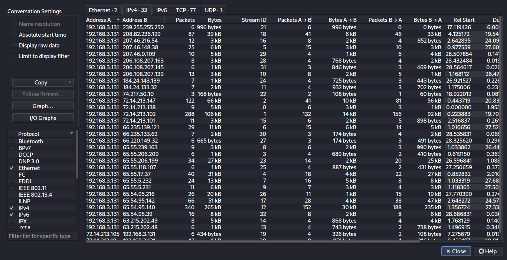
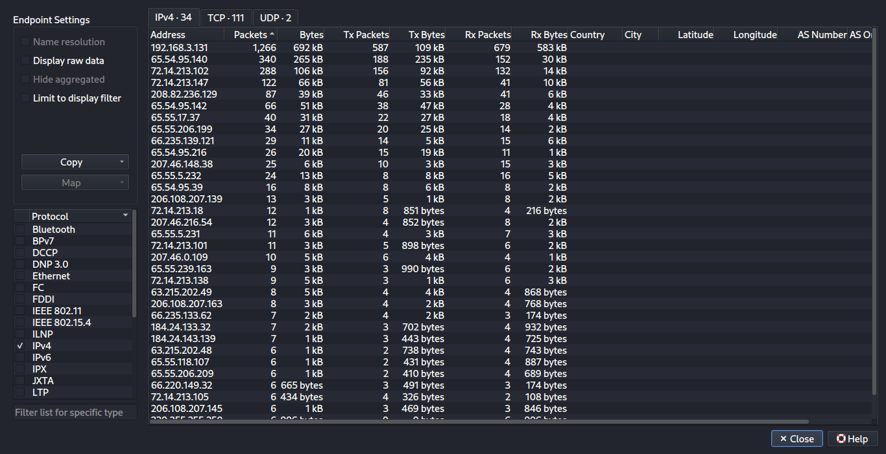
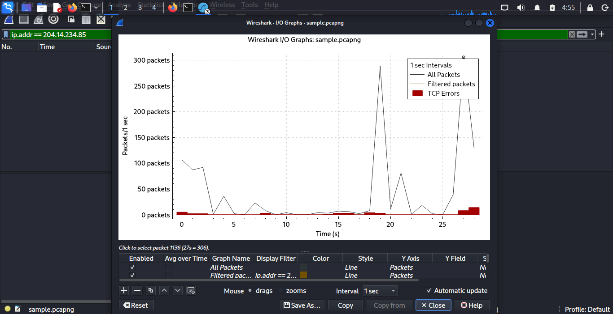
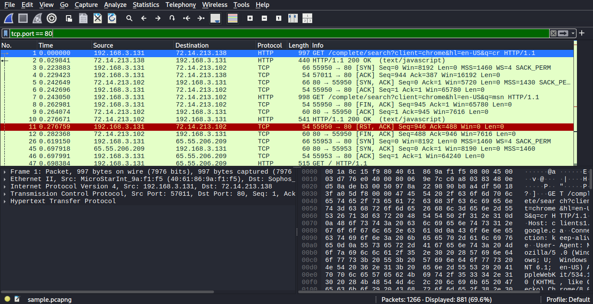
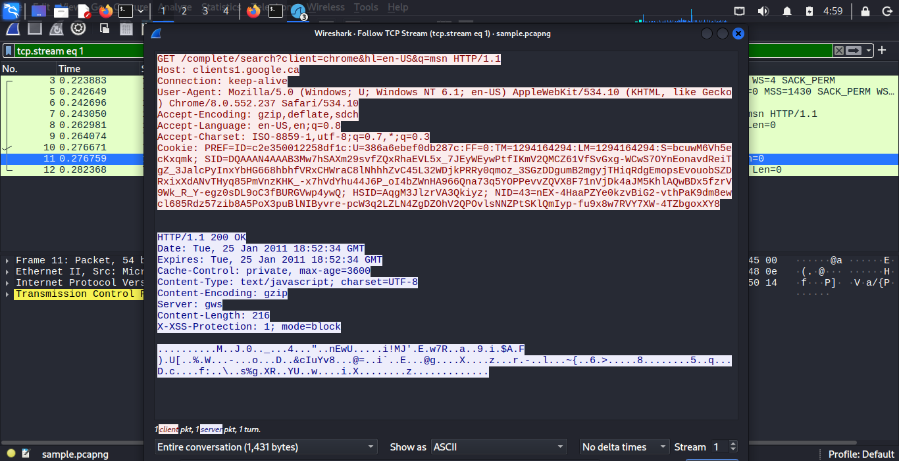
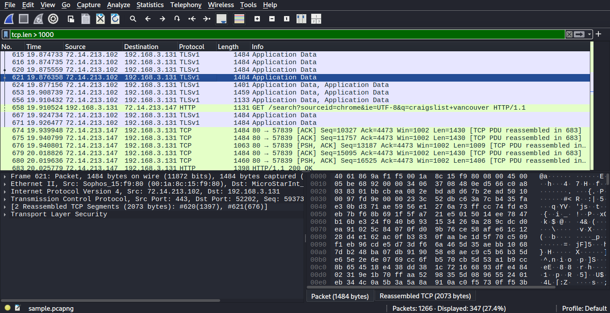
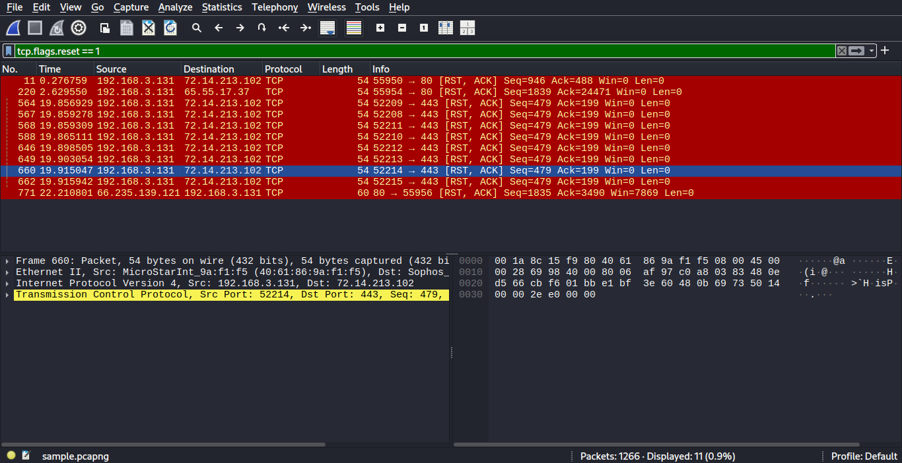

# Project: Forensic Analysis of Network Traffic (sample.pcap)

## Overview

While working through some network forensic exercises, I performed a deep dive into a packet capture named **sample.pcap**. The goal was to reconstruct user activity, identify the host environment, and analyze traffic patterns to determine if the session was benign or malicious.

What makes this specific analysis interesting is the *"time-capsule"* nature of the data—it captures a snapshot of the web from 2011, providing a clear look at unencrypted HTTP traffic that we rarely see in the wild today.

---

## 1. Establishing the Baseline

To start, I needed to see the *"who's who"* of this network segment. I pulled the **Endpoints** and **Conversations** statistics to identify the primary host and its most frequent external contacts.

 

### Findings:

- **Internal Host:** 192.168.3.131  
- **External Noise:** The host was heavily communicating with several IPs, notably **65.54.95.140** and **72.14.213.102**.  
  These resolve to Microsoft and Google services, respectively, suggesting standard OS and browser background activity.

---

## 2. Visualizing Traffic Flow

Next, I used the **I/O Graph** to look for *"heartbeats"* or anomalies.

The graph shows significant bursts of activity around the **18-second** and **27-second** marks.

In a forensic context, these aren't consistent *"beacons"* (which might indicate malware); they look like human-triggered events—loading a page, clicking a link, and waiting for the DOM to render.

I also noted a few **TCP errors (red bars)**, which prompted a closer look at connection stability.

---

## 3. Host Profiling via HTTP Inspection

Because this traffic predates the *"HTTPS Everywhere"* era, I was able to **Follow the TCP Stream** to see exactly what the user was doing without needing SSL/TLS decryption.

### Host Environment Discovered:

- **OS:** Windows 7 (identified by *Windows NT 6.1* in the User-Agent)
- **Browser:** Chrome 8.0
- **Activity:** The user was performing Google searches (e.g., searching for "msn")

---

## 4. Content Analysis & Payload Inspection

I applied a filter for `tcp.len > 1000` to cut through small handshake packets and focus on actual data transfer.

Filtering for large segments allowed me to observe bulk **Application Data** transfers.

One interesting find was an HTTP **GET request** for a search query related to *"craigslist vancouver"*.

This confirms the session was a legitimate user browsing for local information.

---

## 5. Investigating Connection Terminations

Finally, I investigated the TCP errors seen earlier by filtering for reset flags:

While a high volume of **RST flags** can sometimes indicate a port scan or interrupted attack, here they appear to be standard *"housekeeping"*.

The browser is simply closing idle connections to Google’s servers to conserve resources.

---

## Conclusion

After analyzing the **sample.pcap** file, the traffic is classified as:

> **Benign**

This was a classic example of a Windows 7 user performing routine web searches.

### Key Takeaway

The main insight from this exercise is the sheer amount of metadata visible in plain text traffic. Seeing raw cookies and search queries in 2026 is a strong reminder of why the industry shifted heavily toward universal encryption.

---

## Tools Used

- **Wireshark** (Analysis, I/O Graphing, Stream Following)

### Display Filters:

- `http`
- `tcp.flags.reset == 1`
- `tcp.len > 1000`

  
****
