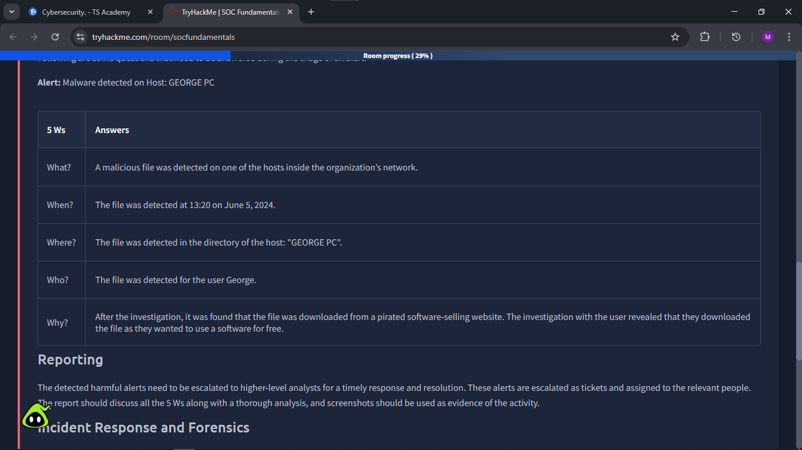
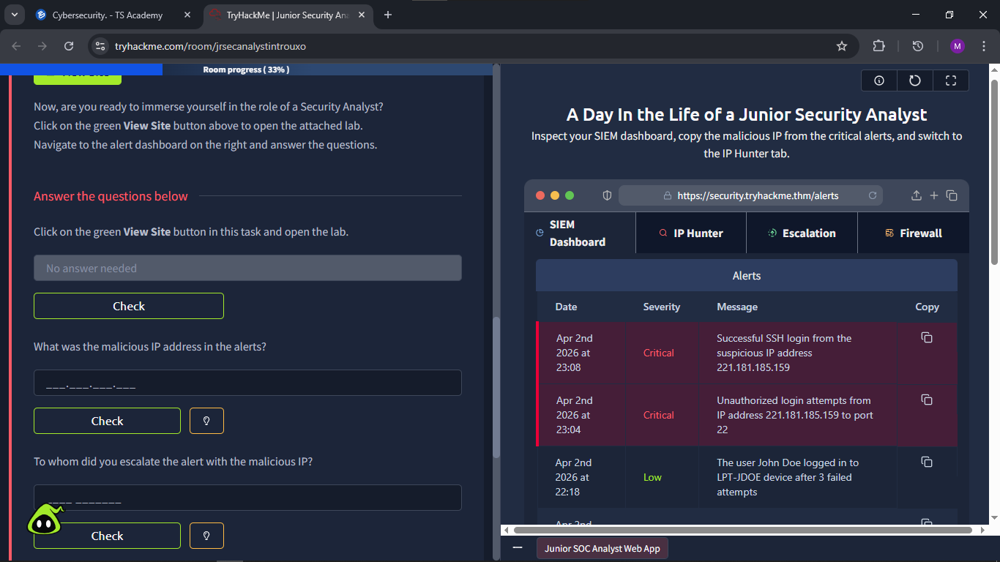

# Practical SOC Exercises – TryHackMe

**Completed:** April 2026 | **Platform:** [TryHackMe](https://tryhackme.com)  
**Rooms:** SOC Fundamentals + Junior Security Analyst Intro (SOC Level 1 Path)

## 1. SOC Fundamentals – Incident Response & Forensics (Practical Exercise)

**Room Overview**  
In the SOC Fundamentals room I learned the core SOC team structure, processes, and technology. The highlight was Task 6: **Practical Exercise of SOC**, where I responded to a real-world malware alert using the **5 Ws framework**.

**What the Alert Showed**  
A malicious file was detected on host **GEORGE PC** at 13:20 on June 5, 2024.

**5 Ws Analysis Table (My Completed Investigation)**

| 5 Ws   |  
|--------|---------|
| **What?** 
| **When?** 
| **Where?** 
| **Who?** 
| **Why?** 
**Reporting & Escalation**  
I documented the full incident and recommended escalation to higher-level analysts as a ticket. Key recommendation: User awareness training on the dangers of pirated software.

**Key Skills Demonstrated**  
- Incident triage using the 5 Ws framework  
- Structured incident reporting and evidence collection  
- Understanding of SOC escalation procedures  
- Basic digital forensics awareness

**Takeaway for Recruiters**  
This exercise gave me hands-on experience mirroring real Tier 1 SOC Analyst duties — quickly analyzing alerts, documenting findings, and preparing tickets for escalation.

---

## 2. Junior Security Analyst – Live SIEM Lab (Hands-on Immersion)

**Room Overview**  
This practical lab placed me directly in the role of a **Junior Security Analyst**. I navigated a live SIEM dashboard, investigated critical alerts, copied malicious IPs, and practiced escalation workflows.

**SIEM Dashboard Snapshot (My Investigation)**

**Key Alerts Investigated**  
- **Critical**: Successful SSH login from suspicious IP `221.181.185.159`  
- **Critical**: Unauthorized login attempts from the same IP to port 22  
- **Low**: User John Doe login after 3 failed attempts

**Tasks Completed**  
- Identified the malicious IP address: `221.181.185.159`  
- Switched to IP Hunter tab for enrichment  
- Escalated the critical alert to the appropriate team (following SOC escalation matrix)

**Key Skills Demonstrated**  
- Real-time SIEM monitoring and alert triage  
- Malicious IP identification and enrichment  
- Escalation decision-making under time pressure  
- Practical use of SIEM tabs (Dashboard → IP Hunter → Escalation)

**Key Takeaway**  
This lab simulated a full day in the life of a Junior SOC Analyst. I now feel confident triaging alerts, using SIEM tools, and escalating threats — core requirements for entry-level Security Operations roles.
